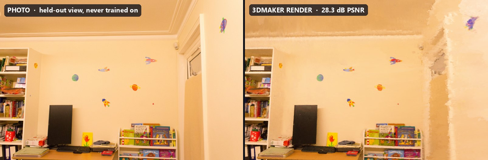
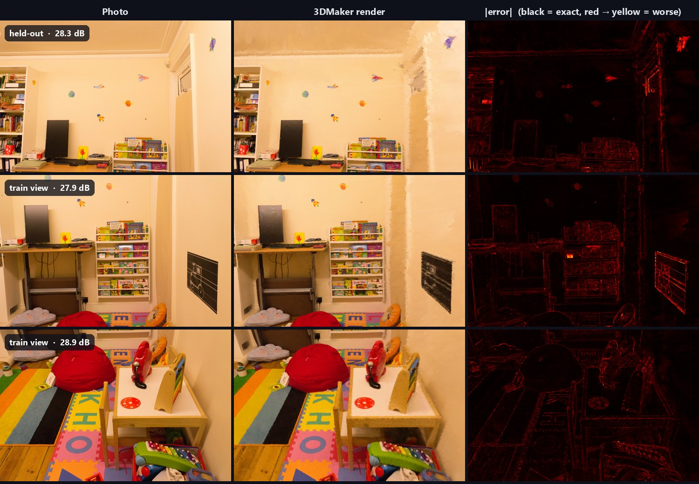
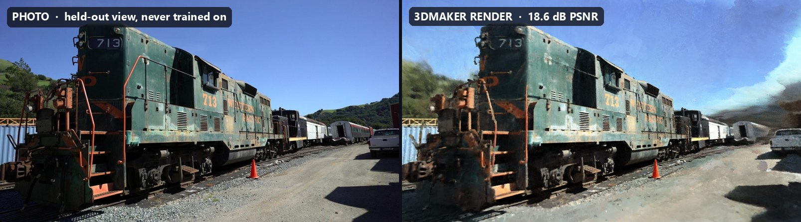

<div align="center">

# 3DMaker

**Phone video → explorable 3D scene, with a NeRF engine written from scratch in C++/CUDA.**

No PyTorch, no TensorFlow, no tiny-cuda-nn: the fused tensor-core MLPs, the hash grid, the ray marcher
and the optimizer are all hand-written.




<sub>Deep Blending "playroom": a camera the model <b>never trained on</b>. Left: real photo. Right: 3DMaker render.
Stock settings, 8 min of training on a laptop RTX 4060.</sub>

</div>

---

## At a glance

All numbers below were measured on a **laptop RTX 4060 (8 GB, 115 W)** with this repo's stock settings.
Reproduce them with [`scripts/e2e_check.py`](#measure-it-yourself).

| | Result |
|---|---|
| **Indoor quality**: Deep Blending *playroom*, 29 held-out views | **27.8 dB PSNR** stock, **28.1 dB** with `fit_room.py` (Instant-NGP: 19.5–21.7 dB; 3DGS-7K: 29.25 dB) |
| **Training time** | **5 min** at 30k steps (−0.06 to −0.15 dB) · **8 min 14 s** at the default 50k (~9.5 ms/step) |
| **End to end**: 225 raw photos → COLMAP → trained model | **~9 min** at 30k steps · **11 min 56 s** at 50k (225 / 225 images registered) |
| **Peak GPU memory while training** | **~1.0 GB** (whole GPU, incl. CUDA context) |
| **Hash-grid + MLP throughput** (inference, hidden 64) | **~300 M points/s** |
| **vs NVIDIA tiny-cuda-nn**, same GPU, same harness | MLP inference **1.7× faster**, MLP backward **1.4× faster**, hash-grid training 0.75× ([details](compare_tcnn/README.md)) |
| **Native viewer** | 4–12 FPS at 800×800 (full MLP ray marching per pixel) |

---

## Contents

- [Quick start: Windows](#quick-start-windows)
- [Quick start: Linux](#quick-start-linux)
- [Try it on the playroom dataset](#try-it-on-the-playroom-dataset)
- [Train on your own video or photos](#train-on-your-own-video-or-photos)
- [View a model with 3DViewer](#view-a-model-with-3dviewer)
- [Measure it yourself](#measure-it-yourself)
- [Results in detail](#results-in-detail)
- [How it works](#how-it-works)
- [Known limitations](#known-limitations)
- [Repository layout](#repository-layout)
- [Tests and benchmarks](#tests-and-benchmarks)
- [Credits](#credits)

---

## Quick start: Windows

### 1. Requirements

| Tool | Version | Notes |
|---|---|---|
| **NVIDIA GPU** | Turing or newer (RTX 20-series+) | CUDA 13 dropped older GPUs; Volta/Pascal need CUDA 12.x. The build targets **sm_89 (RTX 40)** by default; see [step 3](#3-build) |
| **Visual Studio** | 2022 or 2026 | Workload **"Desktop development with C++"** |
| **CUDA Toolkit** | 12.x or 13.x (tested: **13.2**) | Install *after* Visual Studio so its VS integration is added |
| **CMake** | ≥ 3.24 | |
| **Git** | any | |
| **Python** | ≥ 3.9 with `numpy` (+ `Pillow` for `e2e_check.py`) | Must be callable as `python` |
| **FFmpeg** | any recent | On `PATH`. Needed for video input and `--video` |
| **COLMAP** | 3.9+ **CUDA build** | On `PATH`, or unzipped into `third_party\colmap\` ([step 4](#4-install-colmap)) |

Most of these install with `winget` from PowerShell. Visual Studio and COLMAP are separate downloads.

```powershell
winget install Kitware.CMake Git.Git Python.Python.3.12 Gyan.FFmpeg Nvidia.CUDA
python -m pip install numpy pillow
```

Visual Studio: https://visualstudio.microsoft.com/ (Community is fine; select *Desktop development with C++*).

### 2. Clone

```powershell
git clone https://github.com/Ajitesh-07/3DMaker.git
cd 3DMaker
```

### 3. Build

```powershell
cmake -S . -B build
cmake --build build --config Release -j
```

This produces `build\Release\3DMaker.exe` (train) and `build\Release\3DViewer.exe` (view). The first configure
downloads GLFW, FreeType and RmlUi, so it needs internet.

> **Not an RTX 40-series GPU?** Edit `set(CMAKE_CUDA_ARCHITECTURES "89")` in the root `CMakeLists.txt` before
> building: `75` = RTX 20, `86` = RTX 30, `89` = RTX 40, `120` = RTX 50 (needs CUDA ≥ 12.8). Then delete `build\`
> and rebuild.

### 4. Install COLMAP

COLMAP solves the camera poses. It is **not** in the repo (`third_party/colmap` is gitignored). Download the
latest **`*-windows-cuda.zip`** from https://github.com/colmap/colmap/releases, then either add its `bin` folder
to `PATH`, or extract it so that this file exists:

```powershell
Test-Path third_party\colmap\bin\colmap.exe   # should print True
```

### 5. Check the toolchain

```powershell
nvcc --version; cmake --version; python -c "import numpy; print('numpy ok')"; ffmpeg -version | Select-Object -First 1
```

Then jump to [Try it on the playroom dataset](#try-it-on-the-playroom-dataset).

---

## Quick start: Linux

> \***Not yet tested on Linux.** The code and CMake are written to be portable (MSVC-only flags are guarded,
> and Python is called as `python3`), but nobody has built it on Linux yet. Please report what breaks.

### 1. Requirements (Ubuntu 24.04)

```bash
sudo apt update
sudo apt install -y build-essential cmake git python3 python3-numpy python3-pil ffmpeg colmap \
    libx11-dev libxrandr-dev libxinerama-dev libxcursor-dev libxi-dev libgl1-mesa-dev unzip curl
```

- **CUDA Toolkit 12.x or 13.x:** install from https://developer.nvidia.com/cuda-downloads and make sure `nvcc`
  is on `PATH`.
- **CMake ≥ 3.24** is required. Ubuntu 24.04 ships 3.28; on 22.04 use `pip install cmake` instead.
- **COLMAP:** the distro package may be built **without CUDA**, which makes feature extraction and matching much
  slower. For real captures, build COLMAP with CUDA (see COLMAP's install docs).

### 2. Clone and build

```bash
git clone https://github.com/Ajitesh-07/3DMaker.git
cd 3DMaker
cmake -S . -B build -DCMAKE_BUILD_TYPE=Release
cmake --build build -j"$(nproc)"
# -> build/3DMaker and build/3DViewer
```

The same GPU-architecture note as Windows applies (root `CMakeLists.txt`, `CMAKE_CUDA_ARCHITECTURES`).

---

## Try it on the playroom dataset

[Deep Blending](http://visual.cs.ucl.ac.uk/pubs/deepblending/) "playroom" is a real indoor room: 225 photos at
1264×832. The download is the ~650 MB archive hosted by the 3D Gaussian Splatting authors. We keep **only the
images** and let 3DMaker solve the camera poses itself, exactly as it would for your own capture.

**Windows (PowerShell, from the repo root):**

```powershell
# download (~650 MB) and extract only the playroom images
New-Item -ItemType Directory -Force data\_downloads, data\playroom | Out-Null
curl.exe -L -o data\_downloads\tandt_db.zip https://repo-sam.inria.fr/fungraph/3d-gaussian-splatting/datasets/input/tandt_db.zip
tar -xf data\_downloads\tandt_db.zip -C data\_downloads db/playroom/images
Move-Item data\_downloads\db\playroom\images data\playroom\images

# COLMAP + training + held-out validation  (~12 min on a laptop RTX 4060)
.\build\Release\3DMaker.exe train --data data\playroom --validate

# explore the result
.\build\Release\3DViewer.exe data\playroom\transforms_train.json data\playroom\model.inerf
```

**Linux:**

```bash
mkdir -p data/_downloads data/playroom
curl -L -o data/_downloads/tandt_db.zip https://repo-sam.inria.fr/fungraph/3d-gaussian-splatting/datasets/input/tandt_db.zip
unzip -q data/_downloads/tandt_db.zip 'db/playroom/images/*' -d data/_downloads
mv data/_downloads/db/playroom/images data/playroom/images

./build/3DMaker train --data data/playroom --validate
./build/3DViewer data/playroom/transforms_train.json data/playroom/model.inerf
```

You should see `225 / 225 frames` registered, training at roughly 9–10 ms/step on an RTX 4060, and
`HELD-OUT VALIDATION PSNR` around **27.8 dB**. The same archive also contains `db/drjohnson` (indoor) and
`tandt/train`, `tandt/truck` (outdoor). Swap the path to try them.

**Faster, and better for rooms.** Playroom is a room, so fit it into the full-resolution box first, then train 30k
steps. That gives 27.95 dB in about 5 minutes, better than the default above in 60% of the time (see
[Which settings to use](#which-settings-to-use)). Reuse the poses from the first run:

```powershell
python scripts/fit_room.py data\playroom data\playroom_fit
.\build\Release\3DMaker.exe train --data data\playroom_fit --steps 30000 --validate
```

On Linux: `python3 scripts/fit_room.py data/playroom data/playroom_fit`, then `./build/3DMaker train --data
data/playroom_fit --steps 30000 --validate`.

---

## Train on your own video or photos

```powershell
# a video: frames are extracted to <name>\images at 8 fps, then COLMAP runs
.\build\Release\3DMaker.exe train --data C:\captures\myroom.mp4 --validate

# or a folder of photos laid out as  myroom\images\*.jpg
.\build\Release\3DMaker.exe train --data C:\captures\myroom --validate
```

On Linux use `./build/3DMaker` with the same arguments.

If the folder already has a `transforms_train.json`, COLMAP is skipped. Delete that file to re-solve the poses.

**Capturing a room (inside-out)?** Re-fit the scene so the whole room sits in the full-resolution box before
training. This is currently a separate step, until `colmap2nerf.py` does it automatically:

```powershell
python scripts/fit_room.py C:\captures\myroom C:\captures\myroom_fit      # writes a new folder; images are not copied
.\build\Release\3DMaker.exe train --data C:\captures\myroom_fit --steps 30000 --validate
```

**Capture tips** (these matter more than any flag):
- Lock exposure and white balance if your camera app allows it, and move slowly and smoothly.
- Record **1080p, not 4K.** Frames are kept at full resolution, and 4K exhausts RAM quickly (see
  [limitations](#known-limitations)). To shrink an existing video:
  `ffmpeg -i in.mp4 -vf scale=-2:1080 -c:a copy out.mp4`
- Keep clips short at first (1–2 min). COLMAP's matching cost grows with the square of the frame count. For a
  longer video, extract fewer frames by running the preprocessing step yourself:
  `python scripts/colmap2nerf.py C:\captures\myroom.mp4 --video_fps 4`, then run `train` on the folder.
- Walk loops that revisit earlier spots, and avoid spinning in place (pure rotation gives COLMAP no parallax).
- Run `python scripts/analyze_capture.py <folder>\transforms_train.json` to score how well the camera path covers
  the scene.

### Options

| Flag | Default | What it does |
|---|---|---|
| `--steps N` | `50000` | Training steps, ~9–11 ms each on an RTX 4060. **`--steps 30000` gives nearly the same quality in ~60% of the time** (playroom: −0.15 dB, 5 min instead of 8; see [results](#which-settings-to-use)) |
| `--validate` | off | Hold out every 8th image and report its PSNR at the end |
| `--video` | off | Also render a 120-frame orbit to `nerf_360.mp4` (needs FFmpeg) |
| `--cascades N` | `0` = auto | Nested occupancy boxes for distant background; raise for big outdoor scenes |
| `--lambda F` | `0.1` | Distortion-loss weight (removes floaters) |
| `--K N` | `1` | Samples per occupied voxel. **If you raise K, lower λ a lot**: K=2 with λ=0.05 collapsed on playroom; use λ ≤ 0.03 |
| `--max-lr F` / `--min-lr F` | `0.01` / `0.0001` | Cosine learning-rate schedule |

Depth supervision from COLMAP's sparse points is on automatically whenever COLMAP produced `depth_train.bin`.

### Outputs (next to your data)

```
myroom/
├── images/                  input frames
├── transforms_train.json    camera poses (+ transforms_test.json, depth_train.bin)
├── model.inerf              trained model: weights + occupancy grid + scene footer
├── frames/view_0..2.png     renders of the first three cameras
└── nerf_360.mp4             only with --video
```

> Training overwrites `model.inerf` in that folder. Copy it first if you want to keep the old one.

---

## View a model with 3DViewer

```powershell
.\build\Release\3DViewer.exe <data>\transforms_train.json <data>\model.inerf
```

| Input | Action |
|---|---|
| Left-drag | Orbit |
| Middle-drag | Pan |
| Scroll | Zoom |

The viewer opens at training camera 0 and ray-marches the neural fields for every pixel directly in CUDA, writing
into an OpenGL buffer (zero-copy interop). Expect **4–12 FPS at 800×800** on an RTX 4060. It is a native
inspection tool; a real-time **web** viewer is the next milestone (see [ROADMAP.md](ROADMAP.md)).

---

## Measure it yourself

`scripts/e2e_check.py` runs the whole pipeline exactly as a user would, timestamps every stage, and compares
renders against the real photos:

```powershell
python scripts/e2e_check.py data\playroom                      # stock settings, as in the tables below
python scripts/e2e_check.py data\playroom --steps 20000 -- --K 1   # other 3DMaker flags go after --
```

It writes into the dataset folder:
- `e2e_summary.json`: stage timings, registered images, held-out PSNR, per-view PSNR;
- `e2e_compare.png`: photo | render | error heatmap;
- `e2e_log.txt`: the full timestamped log.

---

## Results in detail

### Indoor: Deep Blending *playroom* (225 photos, 29 held out)



| Stage | Time |
|---|---|
| COLMAP features / matching / mapping / export | 8 s / 125 s / 83 s / 4 s |
| NeRF training, 30k / 50k steps | 5 min 7 s / 8 min 14 s |
| **Total, raw photos → model** | **~9 min / 11 min 56 s** |

**Published results on playroom, for context.** The other methods used the dataset's own COLMAP poses on stronger
GPUs; we solved our own poses on a laptop, so compare within ±0.5 dB:

| Method | Playroom PSNR | Hardware / training time |
|---|---|---|
| Instant-NGP (Base / Big) | 19.48 / 21.67 | A6000, 6.5 / 8 min |
| Plenoxels | 22.98 | A6000, 28 min |
| **3DMaker, 30k steps** (stock / `fit_room.py`) | **27.74 / 27.95** | **laptop RTX 4060, 5 min** |
| **3DMaker, 50k steps** (stock / `fit_room.py`) | **27.80 / 28.10** | **laptop RTX 4060, 8 min** |
| 3D Gaussian Splatting, 7K iterations | 29.25 | A6000, 4.6 min |
| Mip-NeRF 360 | 29.66 | 48 h |
| 3D Gaussian Splatting, 30K iterations | 30.04 | A6000, 36 min |

<sub>Published numbers: Kerbl et al., *3D Gaussian Splatting*, SIGGRAPH 2023, Table 8.</sub>

**What limits it today:** plain walls. They have few COLMAP features, and the default scene normalization places
the walls in the lower-resolution outer region (see [limitations](#known-limitations)). `fit_room.py` fixes the
placement; the remaining smearing comes from the lack of texture.

### Which settings to use

Same 225 photos, same COLMAP poses, same laptop RTX 4060. Only the normalization and the step count change:

| Normalization | 30k steps | 50k steps (default) |
|---|---|---|
| **Stock** (`colmap2nerf.py` as-is, 3 cascades) | 27.74 dB · 5 min 8 s | 27.80 dB · 8 min 14 s |
| **Room fit** (`scripts/fit_room.py`, 2 cascades) | **27.95 dB · 5 min 5 s** | **28.10 dB** · 8 min 14 s |

<sub>Held-out PSNR over 29 unseen views. Single runs, so differences under ~0.1–0.2 dB are within run-to-run
noise.</sub>

- **30k vs 50k:** 30k steps costs only 0.06–0.15 dB for 38% less training time. The learning rate anneals over
  whatever step count you choose, so a 30k run fully settles. Use 30k when turnaround matters (previews, timed
  on-site processing) and 50k for final-quality renders.
- **When to run `fit_room.py`:** rooms, corridors and other **inside-out** captures, where you walk *inside* a
  space and film the walls around you. It moved 98.7% of playroom's geometry into the full-resolution box (from
  0%) and cleaned up the walls: +0.2 to +0.3 dB.
- **When not to:** **object orbits**, where you circle one thing looking inward (a statue, a car, the train
  below). The stock normalization is designed for that case and already correct. Rule of thumb: if
  `colmap2nerf.py` reports a high `inward` score (≈ 0.9 on Train), skip it; for rooms it reports a lower score
  (0.44 on playroom).
- **Don't raise `--K`** for sharpness without also lowering `--lambda`: K=2 with λ=0.05 collapsed on playroom
  (13 dB).

### Hard outdoor scene: Tanks and Temples *Train* (301 photos)



| Method | Train PSNR |
|---|---|
| 3D Gaussian Splatting, 7K iterations | 18.89 |
| **3DMaker (this repo)** | **18.78** (9.4 min training, 18 min end to end) |
| Mip-NeRF 360 | 19.52 |
| Instant-NGP (Base / Big) | 20.17 / 20.46 |
| 3D Gaussian Splatting, 30K iterations | 21.10 |

The locomotive itself is sharp. The engine is weaker outdoors for two known, fixable reasons: there's **no sky or
background model** (rays that leave the scene show the background colour, the white patches in the sky), and there
are **no per-image appearance embeddings**, so auto-exposure drift averages into washed-out colour.

### The MLP engine vs NVIDIA tiny-cuda-nn

Both libraries were built into one executable and timed with identical code on the same GPU. Full report:
[`compare_tcnn/`](compare_tcnn/README.md).

| Workload (geometric mean over 18 configs) | TinyMLP vs tcnn |
|---|---|
| Plain MLP inference / backward / train | **1.69× / 1.37× / 1.08× faster** |
| Hash grid + MLP inference | parity (0.99×; **1.11× faster** at 3DMaker's config) |
| Hash grid + MLP training | 0.75× (tcnn's fp16 hash-gradient atomics; fix identified) |
| Quality, same data and optimizer | equal (a controlled ablation shows TinyMLP's small edge comes from its biases) |

---

## How it works

```
 video.mp4 / images/ ──► FFmpeg ──► COLMAP SfM ──► transforms_train.json + depth_train.bin
                          frames     poses, sparse     (scripts/colmap2nerf.py)
                                     depth priors
                                                            │
                                                            ▼
                     ┌──────────────── modules/NeRF (INerfTrainer) ────────────────┐
                     │ occupancy bitgrid + mip pyramid + cascades ─► DDA marcher   │
                     │ hit compaction ─► hash grid + density MLP ─► colour MLP     │
                     │ volume rendering + distortion loss + depth-prior loss       │
                     └──────────────────────────────┬──────────────────────────────┘
                                                    ▼
                               model.inerf ──► 3DViewer (CUDA → OpenGL, interactive)
```

**TinyMLP** (`modules/TinyMLP`): the framework-free maths engine. It knows nothing about NeRF.
- **Fully-fused tensor-core MLPs:** the whole network runs in one kernel with activations resident in shared memory,
  using WMMA fp16 math with fp32 accumulation and `cp.async` double-buffered weight loads.
- **Multi-resolution hash grid:** a dense-vs-hashed level split, with hash-gradient scatter blocked per level for L2
  locality (3.8× faster than the naive scatter).
- **Mixed precision:** fp32 master weights, fp16 forward copies, and fused Adam over weights, biases and the hash
  table, with NaN/Inf guards so one bad gradient can't poison the optimizer state.

**NeRF engine** (`modules/NeRF`):
- **Occupancy bitgrid (128³ × 4 mip levels)** with a coarse-to-fine **DDA marcher** that skips empty space, kept up
  to date online with EMA density updates.
- **Hit-centric compaction:** only occupied samples are materialized, which is why training needs ~1 GB of GPU
  memory.
- **Unbounded scenes:** mip-NeRF-360-style **scene contraction** for the hash encoding, plus **nested occupancy
  cascades** for distant background.
- **Regularization:** the **distortion loss** suppresses floaters, and **DS-NeRF-style depth priors** from COLMAP's
  sparse points sharpen geometry.
- **Training details:** random-background augmentation, a cosine learning-rate schedule, held-out validation, and
  self-contained `.inerf` checkpoints that store the scene framing for the viewer.

---

## Known limitations

These are measured and tracked; most have a known fix. See [ROADMAP.md](ROADMAP.md).

- **Rooms are normalized like objects.** `colmap2nerf.py` centres on where the cameras look, so in a room the walls
  land in the compressed outer region. `scripts/fit_room.py` fixes this as a manual step (+0.3 dB and cleaner walls
  on playroom); making it automatic is on the roadmap.
- **No sky/background model, no appearance embeddings.** This is why outdoor scenes lag (18.8 dB on T&T *Train*).
- **COLMAP preprocessing doesn't scale yet.**
  - Exhaustive matching grows with the square of the frame count (~2 min for 225 photos, hours for thousands).
  - Frames aren't downscaled, and the dataset lives in pinned RAM (~4 bytes per pixel).
  - Past ~518 frames at 1080p (~130 at 4K), a 32-bit pixel index overflows. Keep captures short and 1080p for now.
- **K ≥ 2 can collapse training** unless λ is lowered well below 0.1/K.
- **`--video` renders before the model is saved:** a crash during the orbit render loses the training run.
- **The viewer is native and CUDA-only** (4–12 FPS). A web viewer is the next milestone.
- **Linux builds are untested.**

---

## Repository layout

```
src/
  main.cpp              3DMaker: COLMAP (if needed) → train → validate → save → optional orbit video
  render.cpp            3DViewer: interactive CUDA → OpenGL viewer
modules/TinyMLP/        fused tensor-core MLP + hash grid + fused Adam (framework-free; own tests/benchmarks)
modules/NeRF/           scene representation, ray marching, training/rendering loops, .inerf I/O
  NerfTrainer.{h,cu}      INerfTrainer: the public facade used by both apps
  InstantNerf.{h,cu}      occupancy grid, hit-centric train/render loops, save/load
  processRays.cu          DDA marcher + hit compaction
  compositing.cu          volume rendering, distortion + depth losses
  DataLoader.cu           transforms/depth parsing, pinned-memory ray sampling
  BakedNerf*.cu           (in progress) sparse-voxel bake for real-time rendering
scripts/
  colmap2nerf.py          video/images → COLMAP → transforms_train.json + depth priors
  colmap_depth.py         sparse depth-prior extraction
  fit_room.py             re-fit a room capture into the full-resolution box (manual step for now)
  analyze_capture.py      capture-coverage quality gate
  e2e_check.py            end-to-end timing + quality check
compare_tcnn/           TinyMLP vs tiny-cuda-nn benchmark, results and report
media/readme/           figures used in this README
```

---

## Tests and benchmarks

```powershell
# TinyMLP kernel tests and benchmarks
cmake -S modules/TinyMLP -B modules/TinyMLP/build -DTINYMLP_BUILD_TESTS=ON
cmake --build modules/TinyMLP/build --config Release -j

# NeRF harnesses (train_hit.exe exposes extra flags such as --lambda-depth)
cmake -S modules/NeRF -B modules/NeRF/build -DNERF_BUILD_TESTS=ON
cmake --build modules/NeRF/build --config Release -j

# TinyMLP vs tiny-cuda-nn (clones tcnn locally; ~30 min build + run)
#   see compare_tcnn/README.md
```

---

## Credits

- **Methods this builds on:** Instant-NGP (Müller et al. 2022), Mip-NeRF 360 (Barron et al. 2022), DS-NeRF
  (Deng et al. 2022), NerfAcc and Nerfstudio.
- **Tools:**
  - [COLMAP](https://colmap.github.io/) for structure-from-motion
  - [FFmpeg](https://ffmpeg.org/)
  - [GLFW](https://www.glfw.org/), [FreeType](https://freetype.org/) and [RmlUi](https://github.com/mikke89/RmlUi) for the viewer
  - [nlohmann/json](https://github.com/nlohmann/json) and [stb](https://github.com/nothings/stb)
- **Datasets:** Deep Blending (Hedman et al., SIGGRAPH Asia 2018) and Tanks and Temples (Knapitsch et al.,
  SIGGRAPH 2017), via the archive published by the 3D Gaussian Splatting authors (Inria).
- **Benchmark reference:** [tiny-cuda-nn](https://github.com/NVlabs/tiny-cuda-nn) (NVIDIA), used only in
  `compare_tcnn/`.
