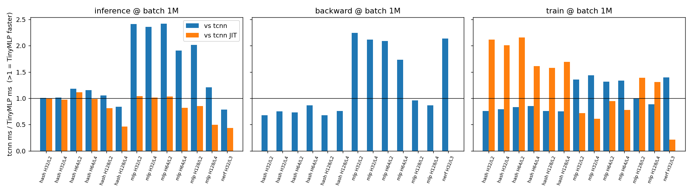
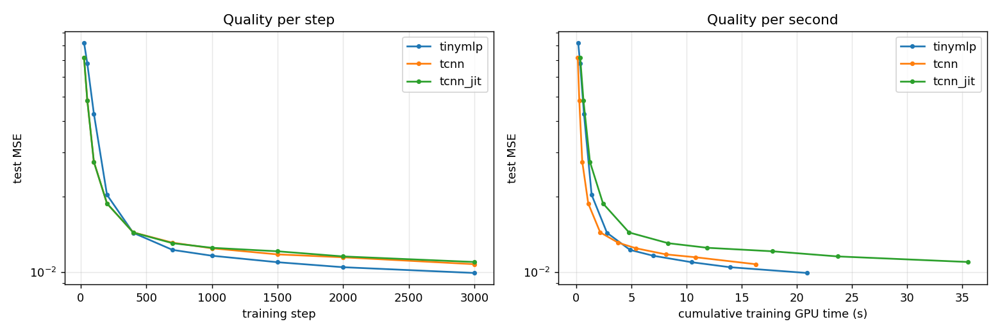

# TinyMLP vs tiny-cuda-nn

- GPU: NVIDIA GeForce RTX 4060 Laptop (sm_89, 8 GB, driver 596.36), CUDA 13.2, MSVC 19.51, Windows 11
- tiny-cuda-nn commit 0109538 (2026-09-22); TinyMLP from this repo at 6212224 (unmodified)
- TinyMLP driven its intended fast way: hash grid takes 4-float positions (as 3DMaker does), train step passes outputs=nullptr. The first run (3-float input + output copy-out) is kept as results/speed_v1.csv.
- Both libraries built by the same nvcc for the same arch with `--use_fast_math`, linked into one executable, timed with identical CUDA-event code on the same stream; each number is the median of 3 runs of N back-to-back launches.
- `tcnn` = precompiled FullyFusedMLP (+ HashGrid); `tcnn JIT` = tiny-cuda-nn 2.x runtime fusion (`set_jit_fusion(true)`), which fuses encoding + MLP (and the whole train step) into one NVRTC kernel. JIT has no standalone backward, so that column is blank.
- Parity caveats: tcnn's MLP has **no biases** (TinyMLP has them); loss scale is each library's default (tcnn 128, TinyMLP 65536); outputs are fp32 on both sides; the convergence/ablation runs use 3-float positions (affects speed only, not quality).

## Headline — geometric-mean ratio (tcnn ms ÷ TinyMLP ms, >1 = TinyMLP faster)

| model | op | vs tcnn (AOT fully fused) | vs tcnn JIT |
|---|---|---|---|
| hashgrid | inference | 0.99× (n=18) | 0.86× (n=18) |
| hashgrid | backward | 0.63× (n=18) | — |
| hashgrid | train | 0.75× (n=18) | **1.48×** (n=18) |
| mlp | inference | **1.69×** (n=18) | 0.71× (n=18) |
| mlp | backward | **1.37×** (n=18) | — |
| mlp | train | **1.08×** (n=18) | 0.98× (n=18) |
| nerf_color | inference | 0.45× (n=3) | 0.34× (n=3) |
| nerf_color | backward | **1.83×** (n=3) | — |
| nerf_color | train | **1.05×** (n=3) | 0.25× (n=3) |

## What 3DMaker actually runs (batch 256K)

Density head = hash grid, hidden 64, 2 layers; colour head = `nerf_color`.

| model | op | TinyMLP ms | tcnn ms | tcnn JIT ms | vs tcnn | vs JIT |
|---|---|---|---|---|---|---|
| hashgrid | inference | 0.856 | 0.950 | 0.949 | **1.11×** | **1.11×** |
| hashgrid | backward | 3.755 | 2.503 | — | 0.67× | — |
| hashgrid | train | 6.905 | 5.423 | 11.894 | 0.79× | **1.72×** |
| nerf_color | inference | 0.168 | 0.052 | 0.043 | 0.31× | 0.26× |
| nerf_color | backward | 0.398 | 0.800 | — | **2.01×** | — |
| nerf_color | train | 0.799 | 1.024 | 0.183 | **1.28×** | 0.23× |

## Full results (ms — TinyMLP / tcnn / tcnn JIT)

### Hash grid + MLP (16 outputs)

**inference**

| H/L \ batch | 64K | 256K | 1M |
|---|---|---|---|
| 32/2 | 0.251 / 0.222 / 0.236 | 0.922 / 0.865 / 0.915 | 3.621 / 3.646 / 3.623 |
| 32/4 | 0.257 / 0.228 / 0.234 | 0.940 / 0.886 / 0.901 | 3.664 / 3.709 / 3.558 |
| 64/2 | 0.217 / 0.239 / 0.247 | 0.856 / 0.950 / 0.949 | 3.375 / 3.981 / 3.772 |
| 64/4 | 0.254 / 0.264 / 0.240 | 0.942 / 1.032 / 0.926 | 3.691 / 4.272 / 3.652 |
| 128/2 | 0.279 / 0.271 / 0.237 | 1.104 / 1.106 / 0.906 | 4.393 / 4.617 / 3.577 |
| 128/4 | 0.449 / 0.365 / 0.228 | 1.747 / 1.434 / 0.826 | 6.947 / 5.841 / 3.222 |

**backward**

| H/L \ batch | 64K | 256K | 1M |
|---|---|---|---|
| 32/2 | 1.319 / 0.579 / — | 3.554 / 2.106 / — | 12.080 / 8.147 / — |
| 32/4 | 1.411 / 0.658 / — | 3.923 / 2.782 / — | 13.658 / 10.221 / — |
| 64/2 | 1.377 / 0.629 / — | 3.755 / 2.503 / — | 13.026 / 9.512 / — |
| 64/4 | 1.547 / 0.922 / — | 4.535 / 3.646 / — | 16.122 / 13.907 / — |
| 128/2 | 1.638 / 0.687 / — | 4.879 / 3.157 / — | 17.518 / 11.850 / — |
| 128/4 | 2.256 / 1.395 / — | 7.403 / 5.409 / — | 27.527 / 20.797 / — |

**train**

| H/L \ batch | 64K | 256K | 1M |
|---|---|---|---|
| 32/2 | 3.599 / 2.439 / 4.143 | 6.784 / 4.906 / 11.297 | 18.571 / 14.134 / 39.322 |
| 32/4 | 3.763 / 2.497 / 4.302 | 7.448 / 5.698 / 12.031 | 21.231 / 16.767 / 42.608 |
| 64/2 | 3.602 / 2.485 / 4.320 | 6.905 / 5.423 / 11.894 | 19.309 / 16.041 / 41.676 |
| 64/4 | 3.929 / 2.813 / 4.151 | 8.315 / 6.875 / 11.515 | 25.125 / 21.443 / 40.429 |
| 128/2 | 3.935 / 2.627 / 4.247 | 8.405 / 6.342 / 11.632 | 25.500 / 19.403 / 40.317 |
| 128/4 | 4.833 / 3.462 / 5.995 | 12.154 / 9.167 / 18.712 | 40.646 / 30.462 / 68.691 |

### Plain MLP (in = out = hidden)

**inference**

| H/L \ batch | 64K | 256K | 1M |
|---|---|---|---|
| 32/2 | 0.056 / 0.068 / 0.023 | 0.206 / 0.436 / 0.221 | 0.826 / 1.996 / 0.860 |
| 32/4 | 0.067 / 0.070 / 0.031 | 0.228 / 0.443 / 0.221 | 0.847 / 1.999 / 0.859 |
| 64/2 | 0.096 / 0.170 / 0.044 | 0.411 / 0.993 / 0.432 | 1.649 / 3.994 / 1.706 |
| 64/4 | 0.146 / 0.174 / 0.061 | 0.535 / 0.996 / 0.432 | 2.087 / 3.980 / 1.706 |
| 128/2 | 0.259 / 0.416 / 0.223 | 0.999 / 1.977 / 0.856 | 3.958 / 7.964 / 3.385 |
| 128/4 | 0.446 / 0.466 / 0.238 | 1.736 / 2.100 / 0.875 | 6.891 / 8.321 / 3.440 |

**backward**

| H/L \ batch | 64K | 256K | 1M |
|---|---|---|---|
| 32/2 | 0.063 / 0.106 / — | 0.292 / 0.517 / — | 1.029 / 2.310 / — |
| 32/4 | 0.129 / 0.163 / — | 0.581 / 1.098 / — | 2.203 / 4.656 / — |
| 64/2 | 0.138 / 0.150 / — | 0.584 / 1.136 / — | 2.228 / 4.649 / — |
| 64/4 | 0.368 / 0.488 / — | 1.345 / 2.273 / — | 5.268 / 9.120 / — |
| 128/2 | 0.623 / 0.486 / — | 2.412 / 2.465 / — | 9.522 / 9.122 / — |
| 128/4 | 1.331 / 1.138 / — | 5.235 / 4.582 / — | 20.910 / 18.139 / — |

**train**

| H/L \ batch | 64K | 256K | 1M |
|---|---|---|---|
| 32/2 | 0.189 / 0.214 / 0.196 | 0.964 / 1.022 / 0.704 | 3.795 / 5.142 / 2.720 |
| 32/4 | 0.318 / 0.298 / 0.242 | 1.394 / 1.875 / 0.874 | 5.521 / 7.919 / 3.387 |
| 64/2 | 0.425 / 0.409 / 0.525 | 1.944 / 2.433 / 1.943 | 7.763 / 10.219 / 7.366 |
| 64/4 | 0.710 / 0.702 / 0.602 | 2.987 / 3.917 / 2.324 | 11.895 / 15.871 / 9.262 |
| 128/2 | 1.294 / 1.001 / 1.890 | 5.170 / 5.110 / 7.292 | 20.569 / 20.522 / 28.539 |
| 128/4 | 2.238 / 1.897 / 3.047 | 8.934 / 7.960 / 11.787 | 35.738 / 31.755 / 46.785 |

### 3DMaker colour head (32 -> 32 -> 32 -> 3, sigmoid)

**inference**

| H/L \ batch | 64K | 256K | 1M |
|---|---|---|---|
| 32/3 | 0.047 / 0.018 / 0.017 | 0.168 / 0.052 / 0.043 | 0.757 / 0.594 / 0.330 |

**backward**

| H/L \ batch | 64K | 256K | 1M |
|---|---|---|---|
| 32/3 | 0.089 / 0.126 / — | 0.398 / 0.800 / — | 1.517 / 3.236 / — |

**train**

| H/L \ batch | 64K | 256K | 1M |
|---|---|---|---|
| 32/3 | 0.180 / 0.115 / 0.056 | 0.799 / 1.024 / 0.183 | 3.435 / 4.789 / 0.744 |

## Convergence — same hash-grid model, same data, same Adam settings

Hidden 64 / 2 layers, batch 256K, 16-channel sinusoid field (1–31 cycles per unit), Adam lr 1e-2, β=(0.9, 0.99), ε=1e-15. Test MSE on 256K held-out points (lower is better); `train ms` is cumulative GPU time spent in training steps.

| step | tinymlp MSE | tcnn MSE | tcnn_jit MSE | tinymlp train ms | tcnn train ms | tcnn_jit train ms |
|---|---|---|---|---|---|---|
| 0 | 0.32885 | 0.32936 | 0.32936 | 0 | 0 | 0 |
| 25 | 0.08218 | 0.07158 | 0.07159 | 174 | 138 | 357 |
| 50 | 0.06777 | 0.04835 | 0.04828 | 348 | 273 | 653 |
| 100 | 0.04278 | 0.02751 | 0.02747 | 696 | 544 | 1242 |
| 200 | 0.02030 | 0.01874 | 0.01875 | 1393 | 1086 | 2424 |
| 400 | 0.01431 | 0.01437 | 0.01436 | 2786 | 2169 | 4787 |
| 700 | 0.01224 | 0.01308 | 0.01301 | 4875 | 3794 | 8331 |
| 1000 | 0.01160 | 0.01242 | 0.01248 | 6965 | 5418 | 11875 |
| 1500 | 0.01093 | 0.01174 | 0.01208 | 10447 | 8126 | 17779 |
| 2000 | 0.01044 | 0.01143 | 0.01153 | 13930 | 10834 | 23684 |
| 3000 | 0.00990 | 0.01073 | 0.01095 | 20895 | 16248 | 35498 |

## Ablation — why does TinyMLP reach lower error?

Same convergence setup. `offset` is the field above (0.5 + 0.4·sin, so a constant output bias is free accuracy); `zeromean` is 0.4·sin with no DC term. Test MSE:

| variant | offset @100 | offset @1000 | offset @3000 | zeromean @100 | zeromean @1000 | zeromean @3000 |
|---|---|---|---|---|---|---|
| TinyMLP (biases, own init) | 0.04278 | 0.01160 | 0.00992 | 0.02010 | 0.01101 | 0.00999 |
| TinyMLP, biases frozen at 0 | 0.05027 | 0.01284 | 0.01042 | 0.01898 | 0.01092 | 0.00996 |
| TinyMLP, no biases + tcnn init | 0.03286 | 0.01239 | 0.01062 | 0.01893 | 0.01107 | 0.01032 |
| tcnn | 0.02752 | 0.01238 | 0.01052 | 0.01712 | 0.01138 | 0.00988 |

## Charts

**Speed ratio at the largest batch**

**Convergence**

