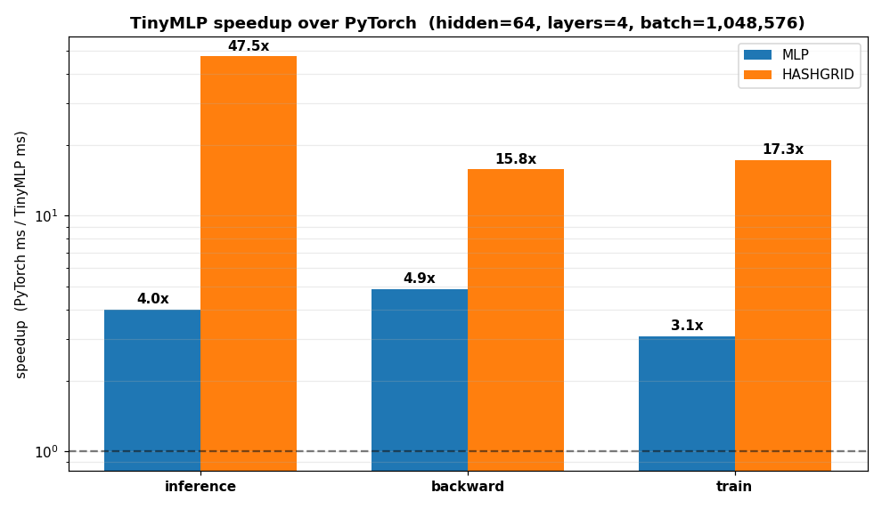
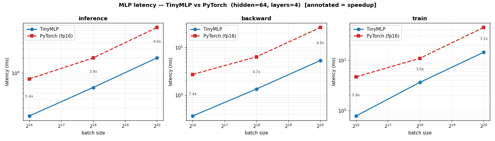
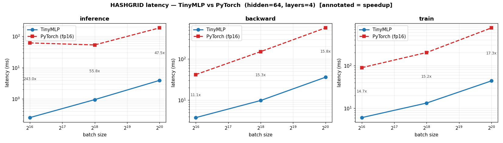
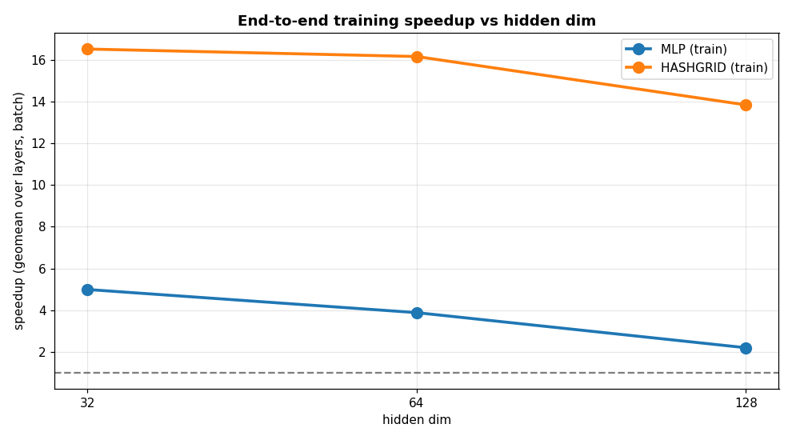

# TinyMLP vs PyTorch — Benchmark Report

**GPU:** NVIDIA RTX 4060 Laptop (sm_89) · **PyTorch:** 2.9.0+cu126 (pure fp16) · **TinyMLP:** fused fp16 WMMA

Latency in ms (lower is better); speedup = PyTorch / TinyMLP (>1 = TinyMLP faster). PyTorch hash grid = naive Instant-NGP-style encoding (the realistic eager baseline).

## Headline — geometric-mean speedup across all configs

| model | inference | backward | train |
| --- | --- | --- | --- |
| mlp | 2.9x | 5.7x | 3.5x |
| hashgrid | 77.9x | 13.8x | 15.5x |

## Speedup at a representative config (hidden=64, layers=4, batch=1,048,576)

| model | op | TinyMLP ms | PyTorch ms | speedup |
| --- | --- | --- | --- | --- |
| mlp | inference | 1.997 | 8.00 | **4.0x** |
| mlp | backward | 5.302 | 25.91 | **4.9x** |
| mlp | train | 14.324 | 44.26 | **3.1x** |
| hashgrid | inference | 3.908 | 185.82 | **47.5x** |
| hashgrid | backward | 36.021 | 567.81 | **15.8x** |
| hashgrid | train | 43.826 | 758.04 | **17.3x** |

## Charts

**Speedup by op/model (batch 1M)**

**Plain MLP latency vs batch**

**Hash-grid MLP latency vs batch**

**Training speedup vs hidden dim**

## Full results

### MLP

**inference** — ms (TinyMLP / PyTorch / speedup)

| H/L \ batch | 65,536 | 262,144 | 1,048,576 |
| --- | --- | --- | --- |
| 32/2 | 0.055 / 0.38 / 6.8x | 0.212 / 0.35 / 1.6x | 0.834 / 1.72 / 2.1x |
| 32/4 | 0.065 / 0.79 / 12.2x | 0.221 / 0.75 / 3.4x | 0.839 / 4.03 / 4.8x |
| 64/2 | 0.093 / 0.36 / 3.8x | 0.421 / 0.85 / 2.0x | 1.665 / 3.42 / 2.1x |
| 64/4 | 0.141 / 0.76 / 5.4x | 0.516 / 2.00 / 3.9x | 1.997 / 8.00 / 4.0x |
| 128/2 | 0.252 / 0.37 / 1.5x | 0.967 / 1.71 / 1.8x | 3.830 / 6.81 / 1.8x |
| 128/4 | 0.430 / 0.70 / 1.6x | 1.667 / 3.99 / 2.4x | 6.616 / 15.95 / 2.4x |

**backward** — ms (TinyMLP / PyTorch / speedup)

| H/L \ batch | 65,536 | 262,144 | 1,048,576 |
| --- | --- | --- | --- |
| 32/2 | 0.063 / 1.58 / 25.1x | 0.293 / 1.96 / 6.7x | 1.046 / 8.47 / 8.1x |
| 32/4 | 0.124 / 2.85 / 23.0x | 0.583 / 2.87 / 4.9x | 2.222 / 12.95 / 5.8x |
| 64/2 | 0.133 / 1.52 / 11.4x | 0.600 / 4.17 / 6.9x | 2.303 / 16.91 / 7.3x |
| 64/4 | 0.369 / 2.72 / 7.4x | 1.348 / 6.33 / 4.7x | 5.302 / 25.91 / 4.9x |
| 128/2 | 0.626 / 1.93 / 3.1x | 2.450 / 8.50 / 3.5x | 9.760 / 34.06 / 3.5x |
| 128/4 | 1.351 / 2.75 / 2.0x | 5.334 / 12.98 / 2.4x | 21.306 / 52.09 / 2.4x |

**train** — ms (TinyMLP / PyTorch / speedup)

| H/L \ batch | 65,536 | 262,144 | 1,048,576 |
| --- | --- | --- | --- |
| 32/2 | 0.252 / 3.47 / 13.8x | 1.283 / 3.51 / 2.7x | 4.985 / 15.34 / 3.1x |
| 32/4 | 0.362 / 5.27 / 14.6x | 1.724 / 4.78 / 2.8x | 6.732 / 22.13 / 3.3x |
| 64/2 | 0.496 / 3.47 / 7.0x | 2.588 / 7.61 / 2.9x | 10.200 / 30.64 / 3.0x |
| 64/4 | 0.787 / 4.67 / 5.9x | 3.632 / 10.88 / 3.0x | 14.324 / 44.26 / 3.1x |
| 128/2 | 1.657 / 3.58 / 2.2x | 6.424 / 15.36 / 2.4x | 25.504 / 61.59 / 2.4x |
| 128/4 | 2.619 / 4.86 / 1.9x | 10.162 / 22.11 / 2.2x | 40.387 / 88.73 / 2.2x |

### HASHGRID

**inference** — ms (TinyMLP / PyTorch / speedup)

| H/L \ batch | 65,536 | 262,144 | 1,048,576 |
| --- | --- | --- | --- |
| 32/2 | 0.274 / 63.50 / 231.6x | 0.933 / 53.34 / 57.2x | 3.889 / 180.37 / 46.4x |
| 32/4 | 0.255 / 62.28 / 244.1x | 0.947 / 54.24 / 57.3x | 3.924 / 182.45 / 46.5x |
| 64/2 | 0.218 / 55.67 / 255.3x | 0.857 / 53.84 / 62.8x | 3.608 / 180.90 / 50.1x |
| 64/4 | 0.253 / 61.55 / 243.0x | 0.950 / 53.01 / 55.8x | 3.908 / 185.82 / 47.5x |
| 128/2 | 0.278 / 55.56 / 199.9x | 1.099 / 54.62 / 49.7x | 4.519 / 183.31 / 40.6x |
| 128/4 | 0.441 / 63.68 / 144.4x | 1.714 / 56.91 / 33.2x | 6.947 / 192.04 / 27.6x |

**backward** — ms (TinyMLP / PyTorch / speedup)

| H/L \ batch | 65,536 | 262,144 | 1,048,576 |
| --- | --- | --- | --- |
| 32/2 | 3.581 / 41.58 / 11.6x | 8.813 / 147.82 / 16.8x | 32.067 / 556.61 / 17.4x |
| 32/4 | 3.620 / 41.33 / 11.4x | 9.209 / 148.86 / 16.2x | 33.601 / 560.83 / 16.7x |
| 64/2 | 3.566 / 41.35 / 11.6x | 9.030 / 148.30 / 16.4x | 32.980 / 558.68 / 16.9x |
| 64/4 | 3.777 / 41.79 / 11.1x | 9.816 / 150.64 / 15.3x | 36.021 / 567.81 / 15.8x |
| 128/2 | 3.846 / 43.44 / 11.3x | 10.125 / 149.38 / 14.8x | 37.233 / 563.48 / 15.1x |
| 128/4 | 4.470 / 42.50 / 9.5x | 12.582 / 154.04 / 12.2x | 47.104 / 581.70 / 12.3x |

**train** — ms (TinyMLP / PyTorch / speedup)

| H/L \ batch | 65,536 | 262,144 | 1,048,576 |
| --- | --- | --- | --- |
| 32/2 | 5.769 / 87.77 / 15.2x | 12.088 / 197.58 / 16.3x | 39.058 / 741.17 / 19.0x |
| 32/4 | 5.906 / 89.06 / 15.1x | 12.597 / 198.38 / 15.7x | 41.021 / 747.53 / 18.2x |
| 64/2 | 5.766 / 88.01 / 15.3x | 12.200 / 197.99 / 16.2x | 39.670 / 744.49 / 18.8x |
| 64/4 | 6.074 / 89.21 / 14.7x | 13.287 / 201.44 / 15.2x | 43.826 / 758.04 / 17.3x |
| 128/2 | 6.091 / 87.13 / 14.3x | 13.622 / 200.08 / 14.7x | 45.358 / 750.88 / 16.6x |
| 128/4 | 6.951 / 87.10 / 12.5x | 16.940 / 206.44 / 12.2x | 58.613 / 779.13 / 13.3x |

